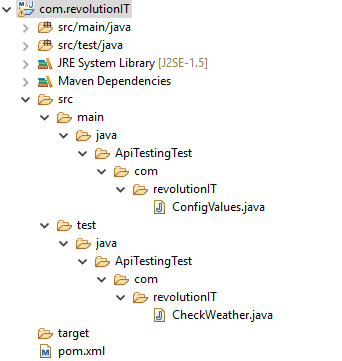
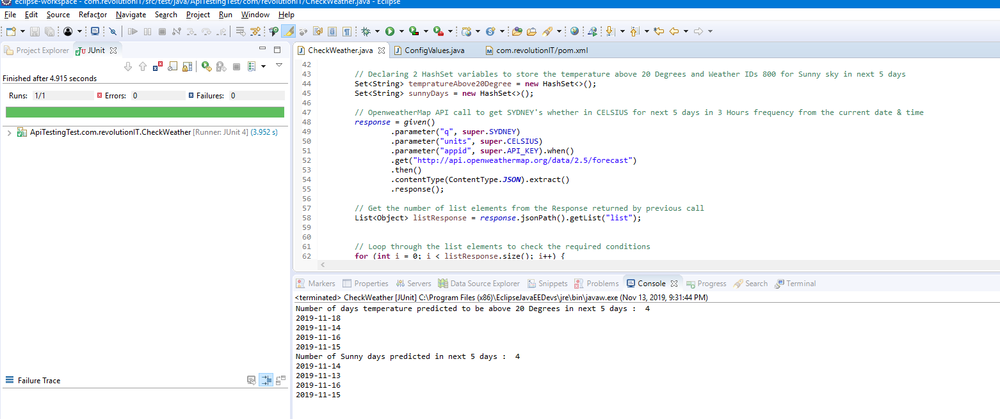

# MyTechChallenge

The purpose of this project is to demonstrate the coding skills by writing a small test to consume the Open Weather Map API to find out the number of days predicated to be above 20 degrees in next 5 days & number of days predicated to be sunny in the same period.

The program has written in Java using Rest Assured & Junit.

1. Clone the project 
2. Build It
3. Navigate to CheckWeather Class 
4. Run JUnit Test checkWeatherTemperatureAndSunnyDays
This will print the predicated number of days temprature above 20 Degrees and Sunny days predicated in next 5 days

# Project Structure: 

# Test Execution: 

